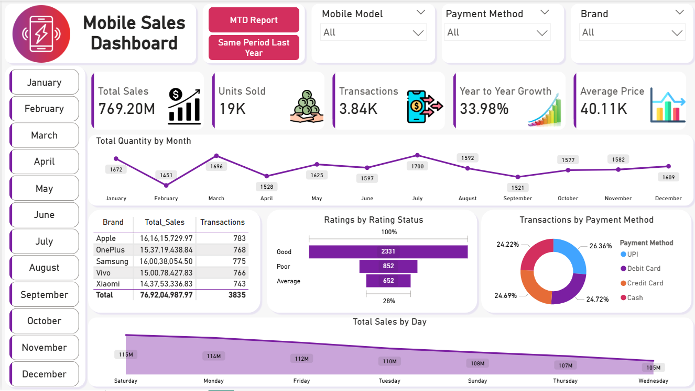
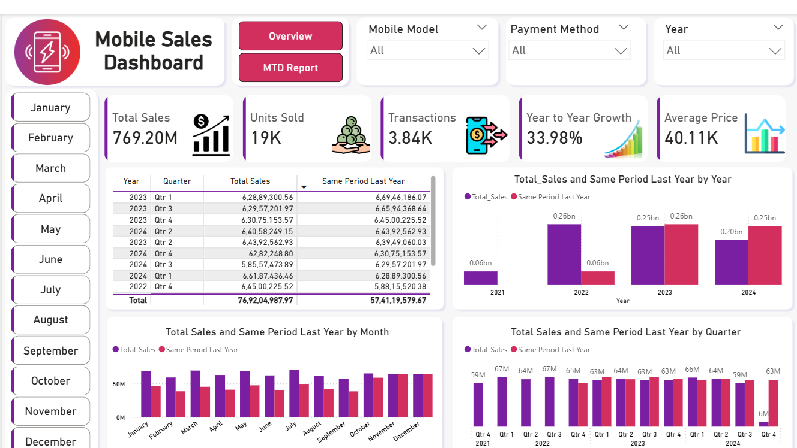

# 📊 Mobile Sales Performance Analysis | Power BI Dashboard

An interactive Power BI dashboard designed to analyze mobile sales performance, growth trends, customer behavior, and payment patterns.
This project helps stakeholders make data-driven decisions using clear KPIs and intuitive visualizations.

# 🚀 Project Overview

This dashboard provides a comprehensive view of mobile sales data across:

Sales performance

Transaction trends

Brand contribution

Payment methods

Customer ratings

Time-based analysis (Month & Day)

The goal is to track growth, identify top-performing segments, and uncover actionable business insights.

# 🛠️ Tools & Technologies

Power BI – Data modeling & visualization

DAX – Calculated measures & KPIs

Microsoft Excel – Data source & preprocessing

Data Visualization Best Practices

# 📸 Dashboard Screenshots

### 🔹 Overview Dashboard

### 🔹 MTD Report

### 🔹 Same Period Last Year

# 📊 Key KPIs Tracked

Total Sales

Total Quantity Sold

Total Transactions

Year-on-Year (YoY) Growth

Average Selling Price

These KPIs provide a quick snapshot of overall business performance.

# 🔍 Business Insights
### 1️⃣ Sales Performance

Strong overall sales with noticeable seasonal variations.

Certain months contribute disproportionately to total revenue.

### 2️⃣ Brand Contribution

A few top brands generate the majority of sales, indicating brand dominance.

Opportunity to boost mid-tier brands through promotions.

### 3️⃣ Payment Method Analysis

Digital payments (UPI, Cards) dominate transactions.

Cash usage is comparatively lower, suggesting a shift toward cashless payments.

### 4️⃣ Customer Ratings

Majority of customers fall under Good ratings.

Improving customer support and post-sales service can convert Average → Good ratings.

### 5️⃣ Day-wise Trends

Sales are higher on specific days of the week.

Useful for planning offers, discounts, and inventory restocking.

# 💡 Business Recommendations

### 📈 Focus marketing campaigns during high-performing months

### 🏷️ Strengthen partnerships with top-selling brands

### 💳 Promote digital payment offers to increase transaction value

### ⭐ Improve customer experience to boost ratings and repeat purchases

# 📌 How to Use the Dashboard

Open the Power BI file from the Dashboard folder

Use slicers to filter by:

Month

Brand

Payment Method

Mobile Model

Analyze KPIs and trends dynamically

spiring Data Analyst | Power BI Developer

🔗 GitH
